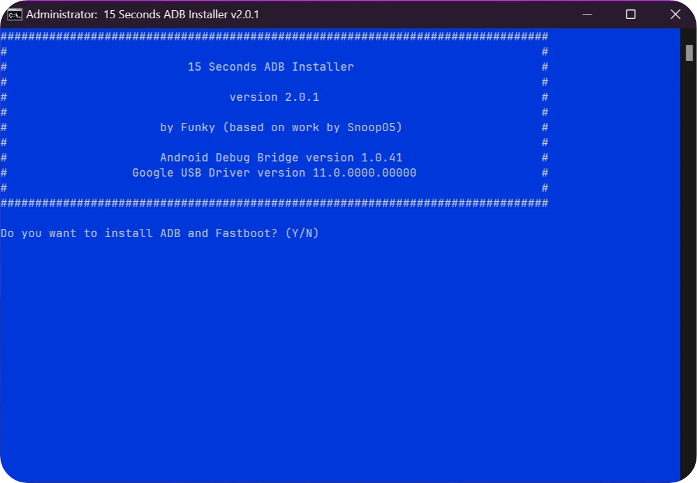

# 15_Second_ADB_Installer
15 Seconds ADB Installer is an All-In-One Windows tool that installs ADB, Fastboot, and drivers in 15 seconds or less.

<h1></h1>

## Features
* **Small File Size**: 15 Seconds ADB Installer is a lightweight tool that takes a few seconds to download and install.
* **Easy to Install**: 15 Seconds ADB Installer is easy to install and doesn't require a full SDK.
* **Easy Interface**: 15 Seconds ADB Installer has an easy-to-use interface that is suitable for beginners and experts alike.
* **All-in-One Tool**: 15 Seconds ADB Installer is an all-in-one tool that includes ADB Fastboot drivers and Android USB drivers.
* **Compatibility**: 15 Seconds ADB Installer is compatible with all Windows OS versions from XP to 11.

## Source
* **[Android MTK](https://androidmtk.com/download-15-seconds-adb-installer)**
* **[SOURCE**FORGE**](https://sourceforge.net/projects/quickadb/)**

## Credits
ADB Installer is created and distributed by [Snoop05](https://forum.xda-developers.com/member.php?u=4638083) (XDA Developer).
